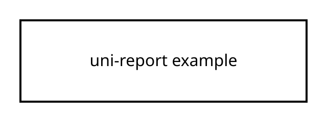

# Мета роботи

Перевірити базовий pipeline генерації звіту.

## Приклад тексту

Це мінімальний приклад звіту, який можна скопіювати в `report/` і зібрати локально.

Inline formula: $a^2 + b^2 = c^2$.

$$
x = \frac{-b \pm \sqrt{b^2 - 4ac}}{2a}
$$

## Приклад зображення

## Висновок

HTML і PDF були згенеровані з одного Markdown-файлу.
